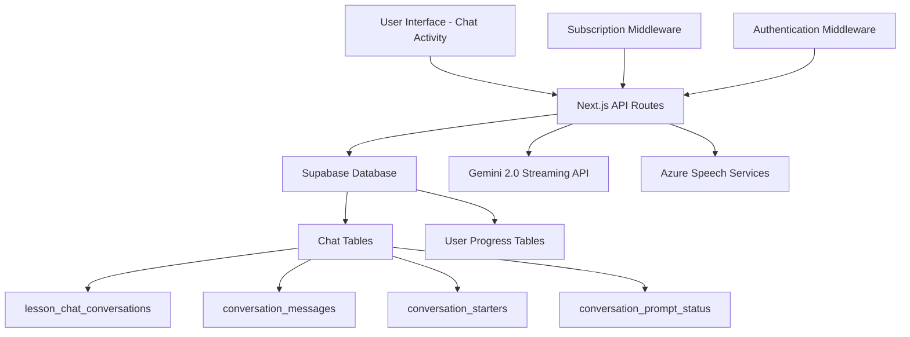
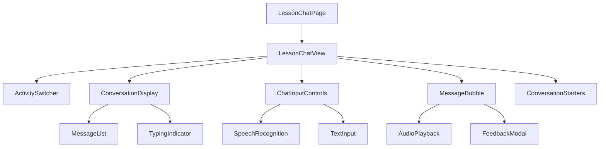

# Design Document

## Overview

The AI Chat Activity feature extends the existing language learning platform by adding a third activity type alongside dictation and pronunciation practice. This feature leverages Gemini 2.0 streaming model for conversational AI capabilities, including both text generation and text-to-speech functionality. The implementation follows the established patterns in the codebase while introducing subscription tier-based access control.

## Architecture

### High-Level Architecture



### Component Architecture



## Components and Interfaces

### 1. Route Structure

Following the existing pattern, the chat activity will be accessible at:

- Route: `/learn/[unitId]/lesson/[lessonId]/chat`
- Page Component: `src/app/learn/[unitId]/lesson/[lessonId]/chat/page.tsx`

### 2. Core Components

#### LessonChatView Component

- **Location**: `src/components/pronunciation/chat/LessonChatView.tsx`
- **Purpose**: Main container component for chat activity
- **Key Features**:
  - Conversation initialization and management
  - Message history display
  - Integration with speech recognition
  - Subscription tier validation

#### ActivitySwitcher Enhancement

- **Location**: Update existing components in dictation and practice views
- **Purpose**: Add third tab for "Chat" navigation
- **Implementation**: Extend existing tab logic to include chat route

#### ChatInputControls Component

- **Location**: `src/components/pronunciation/chat/ChatInputControls.tsx`
- **Purpose**: Handle user input (text and speech)
- **Features**:
  - Microphone recording with visual feedback
  - Text input fallback
  - Speech processing status indicators

#### MessageBubble Component

- **Location**: `src/components/pronunciation/chat/MessageBubble.tsx`
- **Purpose**: Display individual chat messages
- **Features**:
  - User vs AI message styling
  - Audio playback for AI messages
  - Pronunciation feedback display
  - Timestamp and status indicators

### 3. API Routes

#### Chat Prompts Endpoint

```typescript
// GET /api/lessons/[lessonId]/chat-prompts
interface ChatPromptsResponse {
  prompts: Array<{
    id: number;
    starter_text: string;
  }>;
}
```

#### Start Conversation Endpoint

```typescript
// POST /api/lessons/[lessonId]/chat/conversations
interface StartConversationResponse {
  conversation_id: string;
  initial_ai_message?: {
    message_id: string;
    message_text: string;
    sender_type: "ai";
  };
}
```

#### Get Messages Endpoint

```typescript
// GET /api/chat/conversations/[conversationId]/messages
interface Message {
  message_id: string;
  message_text: string;
  sender_type: "user" | "ai";
  message_order: number;
  created_at: string;
  feedback_text?: string;
  azure_pronunciation_data?: object;
}
```

#### Send Message Endpoint

```typescript
// POST /api/chat/conversations/[conversationId]/messages
interface SendMessageRequest {
  audio_blob?: Blob;
  text_message?: string;
  azure_transcript?: string;
  azure_pronunciation_data?: object;
}

interface SendMessageResponse {
  user_message: Message;
  ai_message: Message;
  conversation_status: {
    all_prompts_addressed: boolean;
  };
}
```

### 4. Data Models

#### Conversation State

```typescript
interface ConversationState {
  conversationId: string | null;
  messages: Message[];
  isLoading: boolean;
  isInitializing: boolean;
  error: string | null;
}
```

#### Chat Input State

```typescript
interface ChatInputState {
  isListening: boolean;
  isProcessing: boolean;
  currentText: string;
  recordedAudio: Blob | null;
  pronunciationResults: AssessmentResults | null;
}
```

## Error Handling

### 1. Subscription Tier Validation

- **Client-side**: Disable chat tab for non-pro users with upgrade prompt
- **Server-side**: Validate subscription tier in API middleware
- **Error Response**: Return 403 with upgrade message for unauthorized access

### 2. Gemini API Integration

- **Rate Limiting**: Implement exponential backoff for API calls
- **Fallback**: Graceful degradation when streaming is unavailable
- **Error Messages**: User-friendly error messages for API failures

### 3. Speech Recognition Errors

- **Azure SDK Failures**: Fallback to text input with error notification
- **Network Issues**: Retry mechanism with user feedback
- **Permission Denied**: Clear instructions for microphone access

### 4. Database Errors

- **Connection Issues**: Retry logic with exponential backoff
- **Constraint Violations**: Proper error handling and user feedback
- **Transaction Failures**: Rollback mechanisms for data consistency

## Testing Strategy

### 1. Unit Tests

- **Components**: Test rendering, state management, and user interactions
- **API Routes**: Test authentication, validation, and database operations
- **Hooks**: Test custom hooks for chat functionality and speech recognition

### 2. Integration Tests

- **API Integration**: Test complete flow from frontend to database
- **Gemini Integration**: Mock API responses for consistent testing
- **Speech Recognition**: Test Azure SDK integration with mock audio

### 3. Subscription Tier Tests

- **Access Control**: Test tier-based restrictions across all components
- **Upgrade Flows**: Test upgrade prompts and redirections
- **Lesson Completion**: Test tier-specific completion logic

### 4. End-to-End Tests

- **Complete Chat Flow**: Test full conversation from start to finish
- **Cross-Activity Navigation**: Test switching between dictation, practice, and chat
- **Error Scenarios**: Test error handling and recovery mechanisms

## Implementation Details

### 1. Gemini 2.0 Integration

#### Text Generation

```typescript
// Streaming text generation with Gemini 2.0
const generateAIResponse = async (
  conversationHistory: Message[],
  userMessage: string,
  lessonContext: LessonContext
): Promise<string> => {
  // Implementation using Gemini 2.0 streaming API
  // Include lesson context and conversation history
  // Return generated response text
};
```

#### Text-to-Speech

```typescript
// Gemini 2.0 TTS instead of ElevenLabs
const generateSpeech = async (
  text: string,
  voiceSettings: VoiceSettings
): Promise<AudioBuffer> => {
  // Implementation using Gemini 2.0 TTS capabilities
  // Return audio buffer for playback
};
```

### 2. Database Operations

#### Conversation Management

- Use existing `lesson_chat_conversations` table
- Track conversation state and completion status
- Link conversations to user profiles and lessons

#### Message Storage

- Store all messages in `conversation_messages` table
- Include pronunciation data for user messages
- Track message order and timestamps

#### Progress Tracking

- Update `conversation_prompt_status` when prompts are addressed
- Integrate with existing lesson completion logic
- Award points based on conversation participation

### 3. Subscription Tier Logic

#### Middleware Implementation

```typescript
// Subscription validation middleware
const validateChatAccess = async (userId: string): Promise<boolean> => {
  const profile = await getUserProfile(userId);
  return profile.subscription_tier === "pro";
};
```

#### Lesson Completion Updates

```typescript
// Updated completion logic based on tier
const checkLessonCompletion = (
  userTier: SubscriptionTier,
  activities: CompletedActivities
): boolean => {
  switch (userTier) {
    case "free":
      return activities.dictation;
    case "starter":
      return activities.dictation && activities.practice;
    case "pro":
      return activities.dictation && activities.practice && activities.chat;
  }
};
```

### 4. UI/UX Considerations

#### Activity Tab Enhancement

- Add "Chat" as third tab in existing activity switcher
- Show lock icon for non-pro users
- Implement smooth transitions between activities

#### Responsive Design

- Ensure chat interface works on mobile devices
- Optimize message display for different screen sizes
- Maintain accessibility standards

#### Loading States

- Show initialization progress for new conversations
- Display typing indicators during AI response generation
- Provide clear feedback during speech processing

## Security Considerations

### 1. Authentication

- Validate user authentication for all chat endpoints
- Ensure users can only access their own conversations
- Implement proper session management

### 2. Data Privacy

- Encrypt sensitive conversation data
- Implement proper data retention policies
- Ensure GDPR compliance for user data

### 3. API Security

- Rate limiting for Gemini API calls
- Input validation and sanitization
- Proper error handling without information leakage

### 4. Subscription Enforcement

- Server-side validation of subscription tiers
- Prevent client-side bypassing of restrictions
- Audit logging for access attempts
